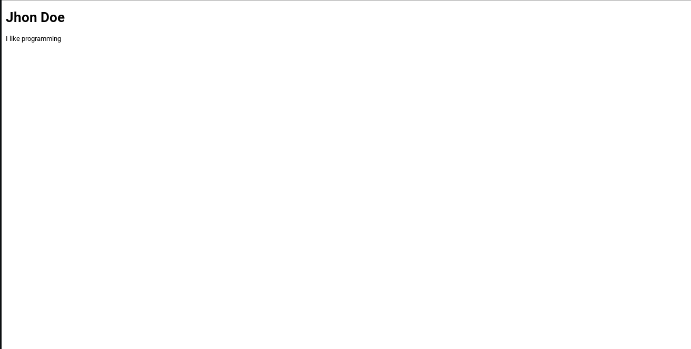

# The Basics


This is a basic tutorial on explaining the **very** basics!


So what is **HTML**? HTML stand for **Hyper Text Markup Language.** It is what all sites are made up of! Even your extensions in your chrome bar. \(If you have Google Chrome\).


### Lets Get Started.

First of all lets introduce the document.



```text
<!DOCTYPE html>
```



What this does is tell our device that it is in **HTML**.


### Lets get the body and head...

```markup
<!DOCTYPE html>
<html>
<head>
</head>
<body>
</body>
</html>
```

As you can see above it looks like a lot of code but it isn't really.


When you put something in &lt;&gt; its called at tag. **&lt;html&gt;** is the opening tag for the html section. And **&lt;/html&gt;** is the closing tag for the html section.



### Lets have a little look.

If you save your file and visit it you will see nothing. Thats because we haven't given it any text or anything.

### A little title.

```markup
<!DOCTYPE html>
<html>
<head>
    <title>My Site</title>
</head>
<body>
</body>
</html>
```

Now that we have added a title save your code again and visit it.


You should now see that our **&lt;title&gt; &lt;/title&gt;** tags have worked as the title of the site is **My Site**. You can change this to whatever you want!

### A bit about me?

Now lets add a paragraph and a title

```markup
<!DOCTYPE html>
<html>
<head>
    <title>My Site</title>
</head>
<body>
    <h1>Jhon Doe</h1>
    <p>I like programming</p>
</body>
</html>
```

In the above code we have added a **Heading** which is basically a title and a **paragraph**! 

* Heading 1 **\(Biggest\)** - Heading 6 **\(Smallest\)**

Now your site should look like this..



